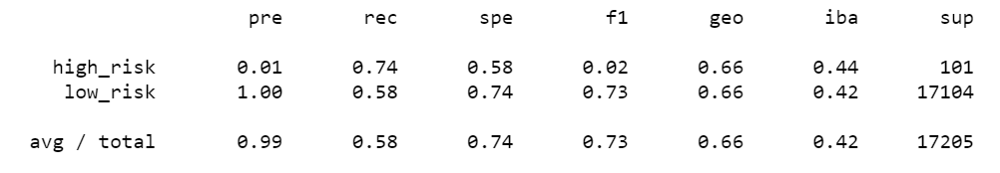
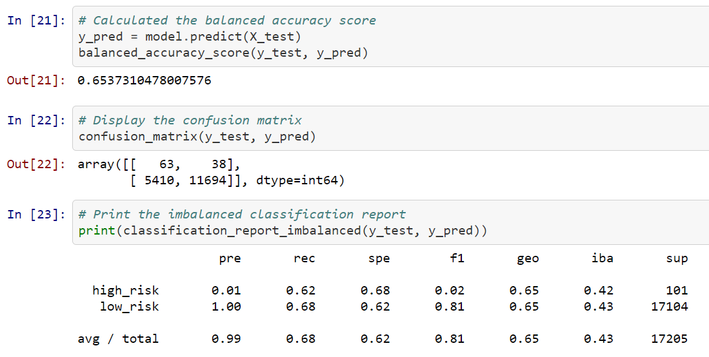
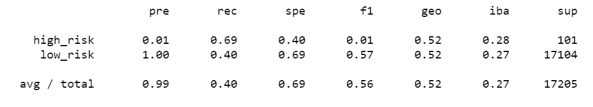
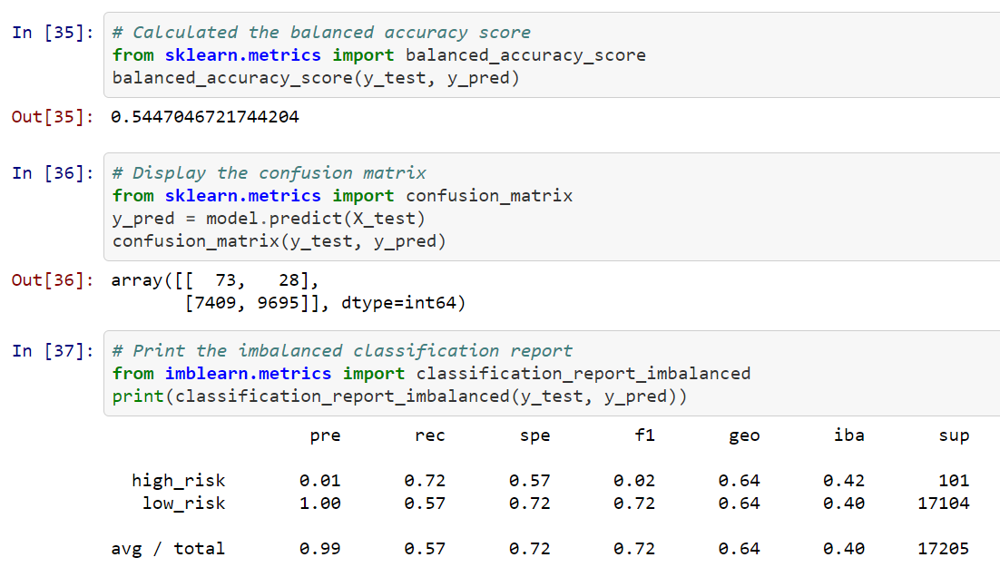
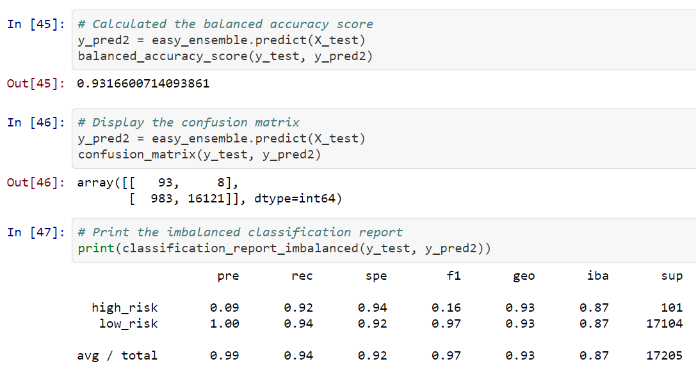

# Credit_Risk_Analysis

## Purpose
The purpose of this project was to use machine learning to help Fast Lending predict credit risk and accurately identify good candidates for loans. The objectives were:
- Oversample the data using the RandomOverSampler and SMOTE algorithms.
- Undersample the data using the ClusterCentroids algorithm.
- Use a combinatorial approach of over- and undersampling using the SMOTEENN algorithm.
- Compare two new machine learning models that reduce bias, BalancedRandomForestClassifier and EasyEnsembleClassifier, to predict credit risk. 
- Evaluate the performance of these models and make a written recommendation on whether they should be used to predict credit risk.

## Resources
- Data Source: [Loan Stats 2019, First Quarter](Resources/LoanStats_2019Q1.csv)
- Software: Anaconda version 4.9.2; Jupyter Notebook version 6.0.3

## Results

### Naive Random Oversampling
<b>Naive Random Oversampling Imbalanced Classification Report</b>
 

### Synthetic Minority Oversampling Technique (SMOTE)
<b>SMOTE Imbalanced Classification Report</b>
 

### Cluster Centroids Undersampling
<b>Cluster Centroids Undersampling Imbalanced Classification Report</b>
 

### Combination Oversampling and Undersampling
<b>Combination Imbalanced Classification Report</b>
 

### Balanced Random Forest Classifier
<b>Balanced Random Forest Classifier Imbalanced Classification Report</b>

 

### Easy Ensemble AdaBoost Classifier
<b>Easy Ensemble AdaBoost Classifier Imbalanced Classification Report</b>

 

## Summary

### Recommendation
