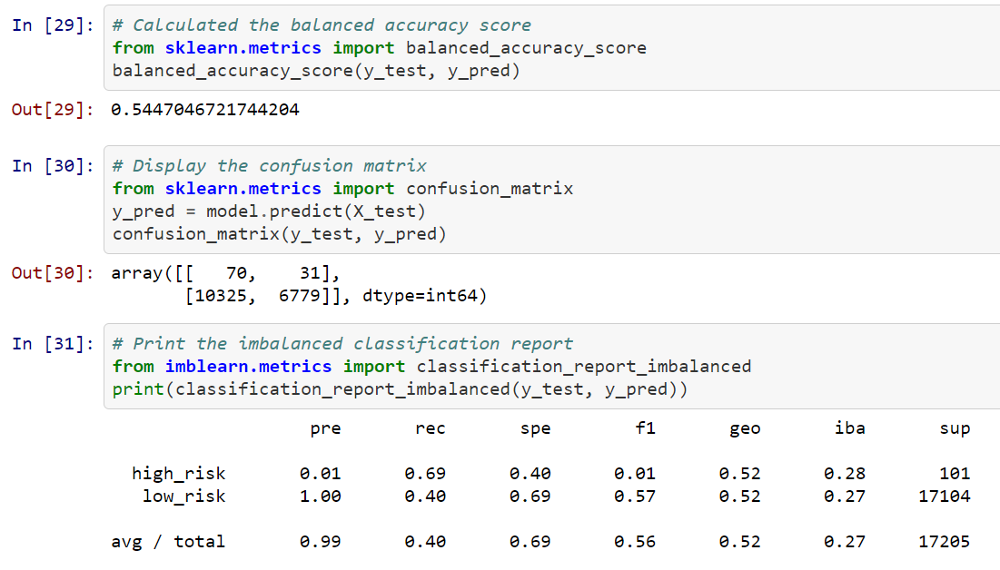

# Credit_Risk_Analysis

## Purpose

## Results

### Naive Random Oversampling
<b>Naive Random Oversampling Imbalanced classification Report</b>
 

### Synthetic Minority Oversampling Technique (SMOTE)
<b>SMOTE Imbalanced classification Report</b>
 

### Cluster Centroids Undersampling
<b>Cluster Centroids Undersampling Imbalanced classification Report</b>
 

### Combination Oversampling and Undersampling
<b> Combination Imbalanced classification Report</b>
 

## Summary

### Recommendation
